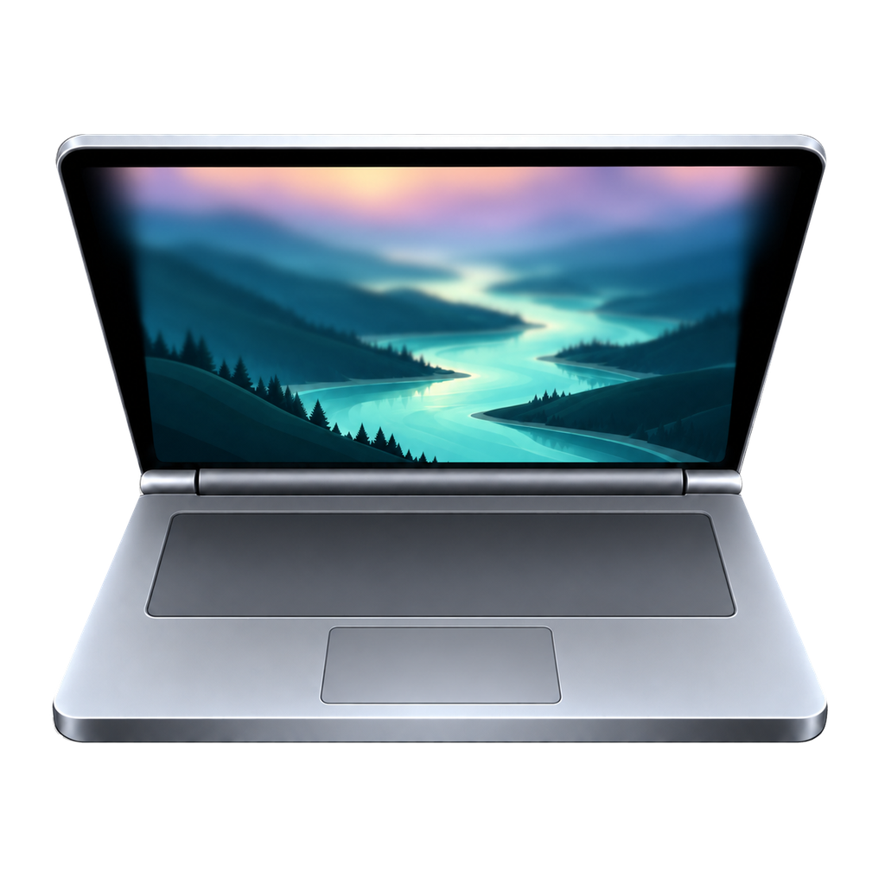
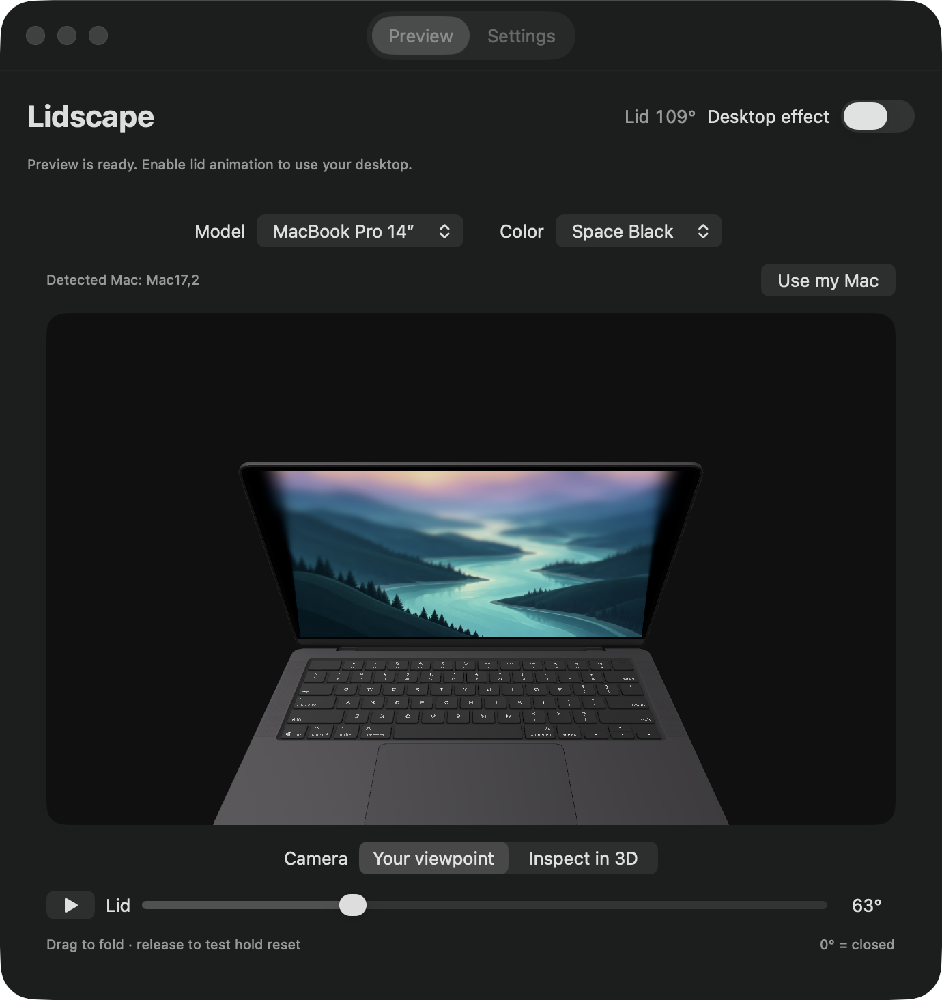
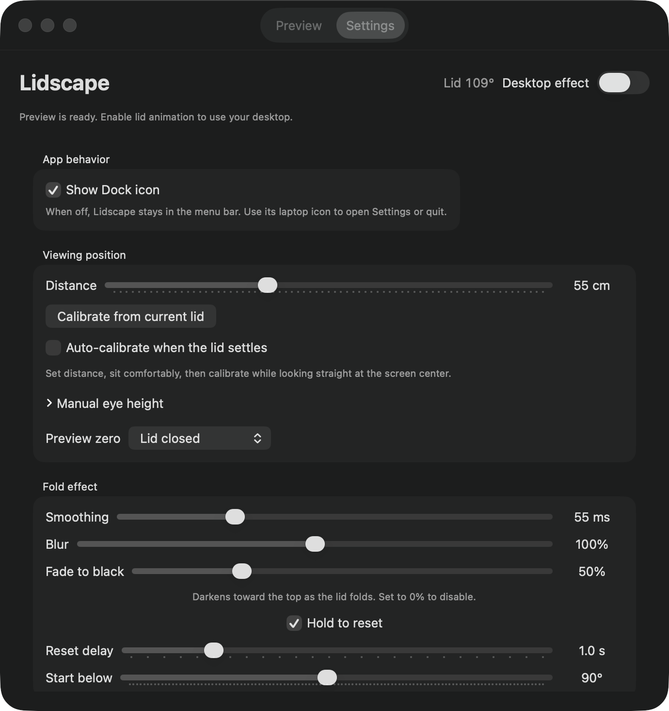

# Lidscape



Inspired by the iPhone Duo fold animation, Lidscape brings the same perspective, blur, and fade effects to your MacBook as you close its lid.



Try the effect in 3D, play it back automatically, or control it with your MacBook’s physical lid.

<details>
<summary>See the settings</summary>



Tune the effect and calibration, save your preferences, and optionally run from the menu bar only.

</details>

## Build and run

[GitHub repository](https://github.com/JavRedstone/Lidscape)

```sh
git clone https://github.com/JavRedstone/Lidscape.git
cd Lidscape
```

Requires **Apple Silicon**, **macOS 14 or later**, and **Xcode Command Line Tools**. Run these commands from the project directory:

```sh
./scripts/build.sh
open "build/Lidscape.app"
```

Apple model files are optional and not included in the repository. See [local model setup](Resources/Models/README.md).

The build uses an available Apple Development signing identity (or `LIDSCAPE_SIGN_IDENTITY`), falling back to ad-hoc signing if none is available. It creates an app in `build/` and bundles the local USDZ assets from `Resources/Models/`. It does not install a login item or change system settings.

## Add an app icon

Place a square **1024 × 1024 PNG** at `Resources/AppIcon/AppIcon.png`, or supply `Resources/AppIcon/AppIcon.icns`. The build prefers the ICNS when both are present; otherwise it converts the PNG into the standard macOS icon sizes. Rebuild and reopen Lidscape to apply it. With no icon supplied, the app uses the default macOS application icon.

See [the icon folder](Resources/AppIcon/README.md). This changes the application icon; the menu bar keeps its laptop symbol.

The app retains its original bundle identifier (`local.macfold.app`) across the rename to preserve its identity. The build output is now `build/Lidscape.app`; any older `build/Mac Fold.app` is a separate, stale build.

## Try the preview

The **Preview** tab works without Screen Recording permission or a supported lid sensor.

1. Choose a model and color. The app selects a matching model family from your Mac's hardware identifier when supported; **Use my Mac** restores that selection. Color is selected manually.
2. Use **Your viewpoint** to see the model from the configured eye position, or **Inspect in 3D** to orbit around it. Returning to Your viewpoint restores the camera.
3. Drag the **Lid** slider. By default, its endpoint is **0° = fully closed**. The model uses the original bundled Lidscape landscape at `Resources/Wallpapers/Lidscape.png`, with the same projection and blur as the desktop effect. A procedural ribbon background is used if the asset is unavailable.
4. Press the play button beside **Lid** to sweep automatically between open and the full slider endpoint (fully closed, or edge-on in eye-relative mode), pausing at each end for the reset delay plus 0.8 seconds. Press pause or drag manually to stop. Playback stops when leaving the preview.
5. Release the slider to try **Hold to reset**, enabled by default. After the reset delay, the image smoothly returns to normal while the lid stays in place. Dragging again smoothly restores the folded projection.

Available previews:

| Model | Colors |
| --- | --- |
| MacBook Pro 14″ | Space Black |
| MacBook Air 13″ | Sky Blue, Silver, Starlight, Midnight |
| MacBook Air 15″ | Sky Blue, Silver, Starlight, Midnight |
| Simple | Procedural fallback |

Detection maps supported hardware identifiers to these model families; it does not download an exact model for every generation. Unknown identifiers keep the default preview and disable Use my Mac. The selected shell is scaled to the detected display dimensions for projection comparison.

## Use the physical lid

Enable **Desktop effect** and grant Screen Recording access when prompted. If needed, enable Lidscape in macOS System Settings → Privacy & Security → Screen Recording, then restart the app.

Slowly close the lid below **Start below**. The app captures the desktop and presents a click-through overlay on the built-in display. Opening past the threshold, completing a hold reset, pausing, or quitting dismisses the overlay. The menu bar provides enable/pause and quit controls.

The preview slider only controls the preview. The desktop effect follows the physical lid sensor.

## Menu bar mode

In **Settings → App behavior**, turn off **Show Dock icon** to run Lidscape from the menu bar only. This also removes it from the Command-Tab app switcher. The preference survives relaunch. Use the laptop menu bar icon → **Open Lidscape…** to reopen the window, or **Quit Lidscape** to exit. Turn Show Dock icon back on to restore normal Dock behavior.

## Settings and calibration

For a comfortable working position, set **Distance**, position the lid, look straight at the screen center, then click **Calibrate from current lid**. This sets the starting angle and estimates eye height assuming your view is perpendicular to the screen center. It is a posture assumption, not head tracking. Recalibrate after changing posture or distance.

| Setting | Default | Behavior |
| --- | --- | --- |
| Distance | 55 cm | Horizontal distance from the hinge plane to your eyes. |
| Manual eye height | 30 cm | Eye height above the hinge; calibration replaces this estimate. |
| Preview zero | Lid closed | Choose Edge-on to eyes to end the slider where the panel aligns with the eye-to-hinge line. |
| Auto-calibrate when the lid settles | Off | Calibrates once per stationary hold; movement rearms it. |
| Calibration delay | 1 s | Independent of hold-reset timing; adjustable from 0.5–8 s. |
| Minimum calibration angle | 30° | Blocks automatic calibration below this physical lid angle; adjustable from 0–120°. |
| Smoothing | 55 ms | Response time for following angle changes; adjustable from 25–140 ms. |
| Blur | 100% | Progressive blur strength; adjustable from 0–200%. |
| Fade to black | 50% | Darkening increases with fold progress and toward the top; adjustable from 0–200%, with 0% off. |
| Hold to reset | On | Returns the image to normal after holding still. |
| Reset delay | 1 s | Delay after holding still; adjustable from 0.5–3 s. |
| Start below | 90° | Reference angle for the effect; adjustable from 35–150°. Calibration also sets this value. |

Both manual and automatic calibration require sensor angles between **60° and 150°**. The minimum calibration angle is an additional automatic-calibration restriction: setting it below 60° does not extend that supported range. After falling below the minimum, the lid must rise 1.5° above it and complete a fresh calibration delay.

Auto-calibration and hold reset are independent. If calibration is pending during an active overlay, the image returns to normal before the new calibration is applied, even when Hold to reset is off. The minimum calibration angle does **not** restrict hold reset or the fold effect.

**Reset settings** restores the defaults above, resets the preview and camera, reselects the detected model family, and turns Desktop effect off. It does not revoke macOS permissions. Settings save automatically in macOS preferences and survive quitting. Model, color, viewing position, calibration, smoothing, blur, fade, and hold options are restored. Live preview position and the Desktop effect enable switch start fresh each launch. Reset settings also saves the restored defaults.

## How the effect works

The image represents a stationary plane while the physical lid rotates. A perspective shader casts a ray from the configured eye position through each panel pixel, intersects the reference image plane, and samples the image there. This accounts for vertical foreshortening and perspective width changes. Rays that miss the image are black; an adjustable fade darkens the image as the lid folds, strongest toward the top. Set Fade to black to 0% to disable it. The fade clears smoothly during hold reset.

Progressive blur is applied after projection: sharpest near the hinge and strongest at the top. Blur increases with fold progress. Hold reset and movement reactivation interpolate continuously between the projection and normal image. Preview hold timing starts after releasing the slider.

Display dimensions come from `CGDisplayScreenSize`, with a 302 × 196 mm fallback. The viewer is assumed horizontally centered. Eye-relative preview uses `atan2(eyeHeight, distance)` as its zero point—about 28.6° physical lid angle at the defaults. This changes the preview range and label, not sensor calibration.

Sensor input uses a three-sample median and a 35 ms low-pass filter. Missing readings have a 150 ms grace period. The desktop threshold enters 1.5° below Start below and exits 1.5° above it to avoid threshold chatter. Stationary holds use a 1.5° tolerance.

## Performance and checks

Animation uses `CADisplayLink` and frame-rate-independent smoothing. Preview smoothing runs inside the native preview view, avoiding a SwiftUI update for each smoothed lid frame. Sensor sampling targets 60 Hz; rendering targets the display's maximum refresh rate, including 120 Hz on supported displays.

Core Image renders directly to Metal textures for SceneKit and the desktop overlay. Preview effects render at 1024 pixels wide; desktop effects at up to 1920 pixels before GPU scaling. Production rendering avoids per-frame bitmap readback. A bitmap reference renderer remains for tests.

```sh
./scripts/test.sh
./scripts/benchmark.sh
```

Tests cover projection geometry, calibration, reset defaults, hardware mapping, blur, smoothing, hold timing, and sensor filtering. Graphics checks require access to a macOS graphical session and Metal; restricted or headless environments may fail to render correctly.

The benchmark opens the full SwiftUI preview and simulates slider changes. A local run measured approximately **120 SceneKit render callbacks/s**, with a **9.26 ms p95 frame interval**, over six seconds after warm-up. This measures simulated input and render cadence, not end-to-end physical mouse latency or live desktop capture performance. Frame rate depends on hardware, display refresh rate, and system load.

## Limitations and privacy

- The desktop is a frozen snapshot during the fold, not a live video stream. Captures stay in memory and are not saved to disk.
- Hardware sensor availability varies. Without a valid reading, the desktop overlay stays hidden and the preview remains usable.
- External displays are untouched. The app does not cover the secure login screen or bypass normal lid sleep. Sleep and display reconfiguration dismiss the overlay.
- Imported hinges and the active-display-to-hinge offset are approximate. The preview is useful for evaluating the effect, not an exact mechanical simulation.
- This is an experimental adaptation, not a frame-matched reproduction of the reference transition.

## References and model assets

- [iPhone Duo macOS animation](https://github.com/lqSky7/iphone-duo-macos-animation) — adaptation and effect reference.
- [LidAngleSensor](https://github.com/samhenrigold/LidAngleSensor) — HID sensor protocol reference.

Local previews can use Apple USDZ assets. These binaries are excluded from the repository; a fresh clone uses the procedural laptop fallback until compatible local assets are supplied. Original files remain unmodified; runtime adapters separate the lid, position the hinge, and add the animated display. Source examples:

- [MacBook Pro 14-inch Space Black USDZ](https://www.apple.com/105/media/us/macbook-pro/2025/785e1bc4-d1bd-4cf4-b1b3-94b9411c9e74/ar/macbook-pro-14-in-space-black-variant.usdz)
- [MacBook Air 13-inch Sky Blue USDZ](https://www.apple.com/105/media/us/macbook-air/2026/ff11cb38-708e-4c28-9653-1b01a2f8fd2b/ar/macbook-air-13in-sky-blue.usdz)

Assets belong to Apple. Download availability is not a redistribution license; redistribution rights have not been established for these files. The current integration is a local preview.

## License

Lidscape's original source code and documentation are available under the [MIT License](LICENSE).

Apple's USDZ models and other third-party material are excluded. MIT does not grant permission to redistribute those assets; see [Third-party notices](THIRD_PARTY_NOTICES.md).
