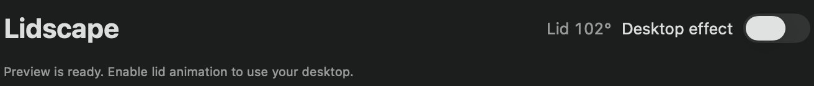
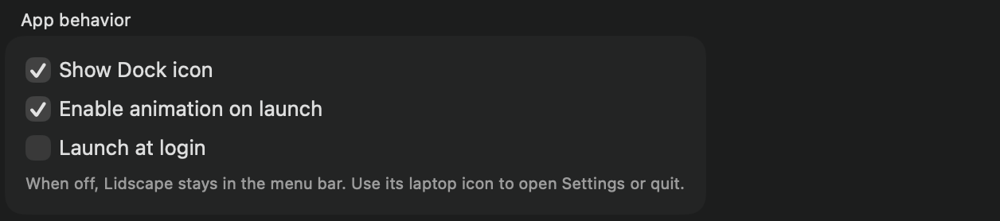

# Install and enable Lidscape

[Guide home](README.md) · [Next: preview controls](preview.md)

## 1. Build and install

From a terminal:

```sh
git clone https://github.com/JavRedstone/Lidscape.git
cd Lidscape
./scripts/build.sh
open -R "build/Lidscape.app"
```

Building requires Apple Silicon, macOS 14 or later, and Xcode Command Line Tools. Apple model files are optional; the Simple model works in a fresh checkout.

In Finder, copy **Lidscape.app** into **Applications**. Quit any running copy before replacing an older version. Open **Applications → Lidscape** from now on; future builds still go into `build/`, so copy each update into Applications.

## 2. Complete setup

On first launch, Lidscape explains Screen Recording and offers **Enable launch at login** or **Not now**. Choose whether it should open when you sign into your Mac. You can change this later.

**Enable animation on launch** is on by default. Lidscape attempts to access the built-in display using ScreenCaptureKit and activates the effect when access succeeds.

## 3. Allow Screen Recording

Approve macOS’s request. If access is denied:

1. Open **System Settings → Privacy & Security → Screen & System Audio Recording**.
2. Enable **Lidscape**. If it is missing, use **+** to select `/Applications/Lidscape.app`.
3. Quit and reopen Lidscape if macOS asks you to.
4. Turn on **Desktop effect** again.



The message below the header explains whether access is being checked, permission is missing, or the app is ready. **Open Screen Recording** appears when permission needs attention. The preview needs no Screen Recording permission.

## 4. Try the physical lid

With Desktop effect enabled, slowly close the lid below the configured **Start below** angle. At the default 90° setting, threshold filtering starts the effect below about 88.5°. Stop moving for a second to see hold reset return your desktop to normal. Move again to reactivate it.

The overlay shows a frozen desktop snapshot during the transition. Once reset finishes or you open past the threshold, your live desktop resumes. The app does not prevent normal lid sleep.

## 5. Choose startup and Dock behavior



- **Show Dock icon:** turn off for menu-bar-only operation. Open the laptop menu → **Open Lidscape…** to return to the window.
- **Enable animation on launch:** attempt to start the desktop effect whenever Lidscape opens. This does not launch the app by itself.
- **Launch at login:** ask macOS to open Lidscape when you sign in. If approval is required, use **Approve in Login Items…** and approve it in System Settings.

The menu bar dot is green when ready or animating, gray when paused, and orange when checking access or needing attention. Open its menu for the exact status. Use **Pause animation** to stop the effect for this session, or **Quit Lidscape** to exit. To stay paused after relaunch, turn off Enable animation on launch.
