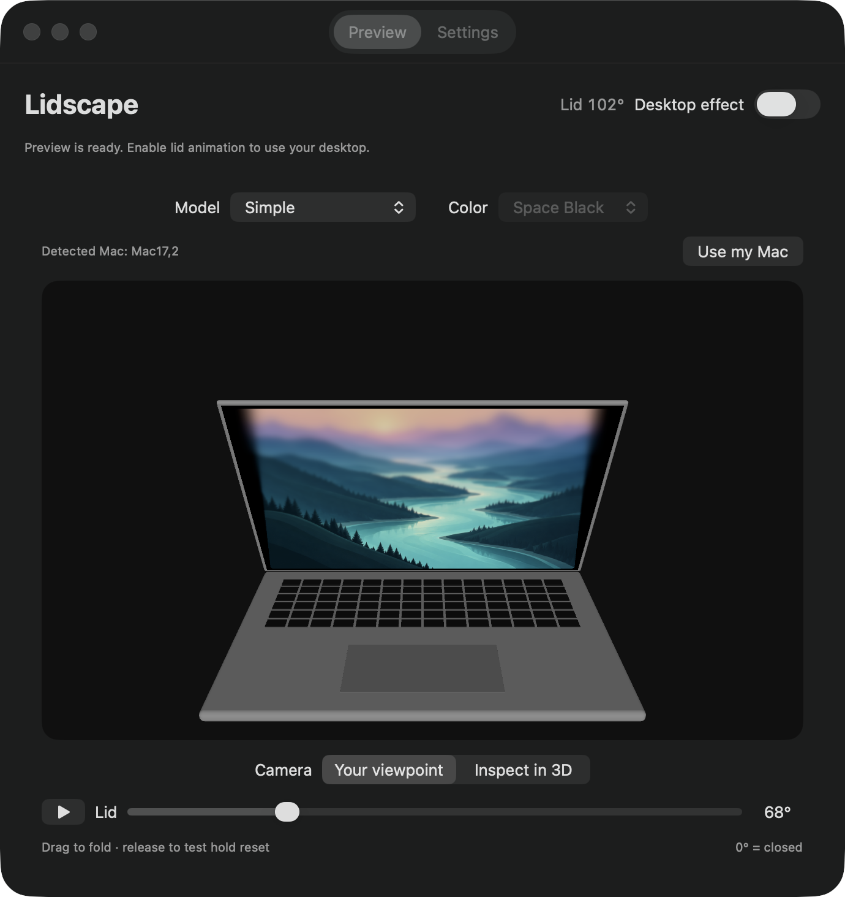
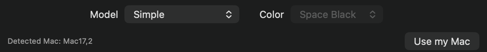
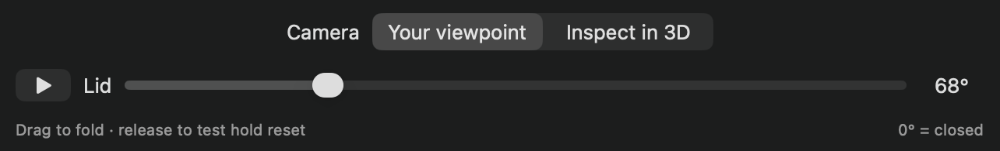

# Preview controls

[Guide home](README.md) · [Next: effect settings](settings.md)

The preview demonstrates the rendering without moving the real lid or granting Screen Recording access.

## Select the laptop

Choose **Simple** for the built-in procedural laptop. Pro 14″ and Air 13″/15″ use optional local Apple model assets; without those assets, their preview falls back to the procedural laptop. Model and color are separate choices. Pro currently offers Space Black; Air offers Sky Blue, Silver, Starlight, and Midnight.

**Use my Mac** selects the supported family corresponding to your hardware identifier. It cannot detect the chassis color. It is disabled for unmapped identifiers.

## Move the lid and camera

1. Choose **Your viewpoint** to view the laptop from the configured eye position.
2. Drag **Lid** toward closed. Watch the wallpaper’s perspective change while blur and fading grow toward the top.
3. Release the slider. With Hold to reset enabled, the image returns to normal after the reset delay while the lid stays in place.
4. Drag again: the effect eases back in.

Choose **Inspect in 3D** to orbit by dragging the model. Use the scroll wheel or two-finger scroll to zoom in and out. Returning to Your viewpoint restores the configured camera.

## Play the sequence automatically

Press the play button beside Lid. The preview sweeps to the full endpoint and back, pausing at each end for the reset delay plus 0.8 seconds. Press pause or start dragging manually to stop. Leaving the Preview tab stops playback.

[Watch the folding and hold-reset demo](images/preview.gif)

## Understand the angle label

In **Settings → Viewing position → Preview zero**:

- **Lid closed:** 0° means physically closed.
- **Edge-on to eyes:** 0° means the panel aligns with the configured eye-to-hinge line. This endpoint can occur before the lid is physically closed.

This changes the preview’s range and label. It does not change the physical sensor or automatically calibrate your position. Auto-calibration uses the real lid; dragging the preview never sets your real working angle.
