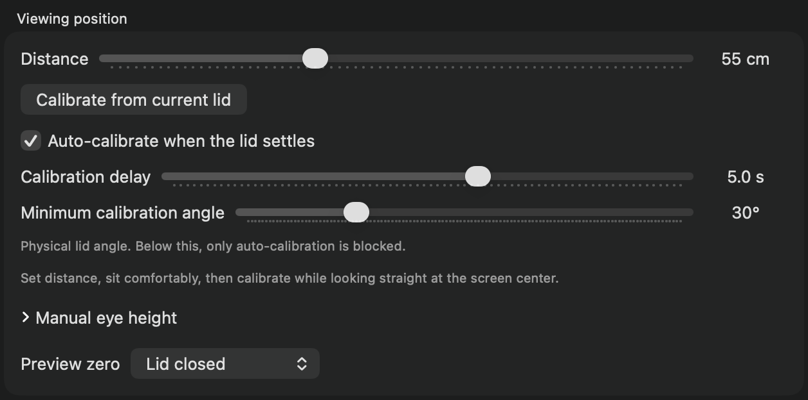
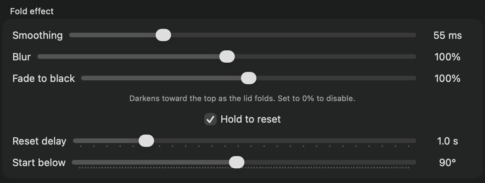
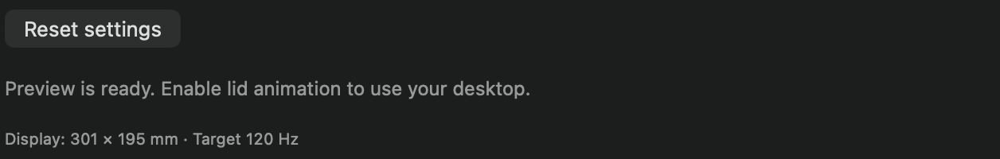

# Effect settings and calibration

[Guide home](README.md) · [Troubleshooting](troubleshooting.md)

Settings save automatically and survive quitting. To see a slider’s effect without moving your real lid, keep the preview partly folded while adjusting it.

## Match your viewing position

1. Set **Distance** to the horizontal distance from your eyes to the hinge plane. The default is 55 cm.
2. Sit in your normal working position and adjust the screen comfortably.
3. Look straight at the screen center and click **Calibrate from current lid**.

Calibration adopts that physical lid angle as **Start below** and estimates eye height assuming your view is perpendicular to the center of the screen. It does not measure your head or eyes. Recalibrate after changing posture or distance. Manual calibration requires a lid-sensor reading between 60° and 150°.

**Manual eye height** lets you adjust the estimate yourself. Height is measured above the hinge; it is not your height above the desk or floor.

## Automatically adopt a new working angle

**Auto-calibrate when the lid settles** defaults to on for new settings. Existing saved choices are retained.

- **Calibration delay — 5 seconds:** leave the physical lid still for this long to adopt its angle. Adjust from 0.5–8 seconds.
- **Minimum calibration angle — 30°:** an additional lower limit for automatic calibration. The supported sensor range is still 60–150°, so a minimum below 60° does not extend it.

For example, move the screen from 90° to 110°, then leave it still for five seconds. Lidscape adopts 110° as its new starting angle and estimates a new eye height. It calibrates once per hold; another movement rearms it.

Below the configured minimum, automatic calibration is blocked. After crossing below it, the lid must rise 1.5° above the minimum and complete a fresh delay. This limit does not block the fold effect or hold reset.

## Tune the appearance and response

| Control | Starting value | How to use it |
| --- | --- | --- |
| Smoothing | 55 ms | Increase for softer motion; decrease for a faster response. Range: 25–140 ms. More smoothing also adds lag. |
| Blur | 100% | Adjust the frosting that increases toward the top as the lid folds. 0% disables it; maximum 200%. |
| Fade to black | 100% | Adjust darkening, strongest toward the top. 0% disables it; maximum 200%. |
| Hold to reset | On | Restore normal perspective and remove blur/fade when the lid stays still. |
| Reset delay | 1 second | How long to hold still before returning to normal. Range: 0.5–3 seconds. |
| Start below | 90° | Set the reference angle and the threshold for starting the desktop effect. Calibration also updates this. |

The real effect enters 1.5° below Start below and exits 1.5° above it. This separation prevents small sensor fluctuations from repeatedly turning it on and off.

## Know which reset you are seeing

**Hold reset changes the image.** Stop moving, wait for Reset delay, and perspective, blur, and fading ease away. The overlay disappears so you can use your live desktop at that angle. Your calibrated reference stays the same. Movement within the effect range reactivates the projection.

**Auto-calibration changes the reference angle.** It waits for Calibration delay and adopts a new working angle. If the overlay is active, it first completes a return to normal. This can happen even if Hold to reset is off.

The timers are independent. With defaults, the image can return to normal after one second, while calibration waits five seconds before adopting the angle. Turn off Auto-calibrate if you want to keep one fixed reference position; turn off Hold to reset if you want the projection to remain visible while stationary.

## Restore defaults

Click **Reset settings** to restore effect, calibration, preview, and Dock/startup-animation preferences. The reset is saved immediately and Desktop effect is paused for the current session. It does not revoke Screen Recording permission or unregister Launch at login; manage those separately.
